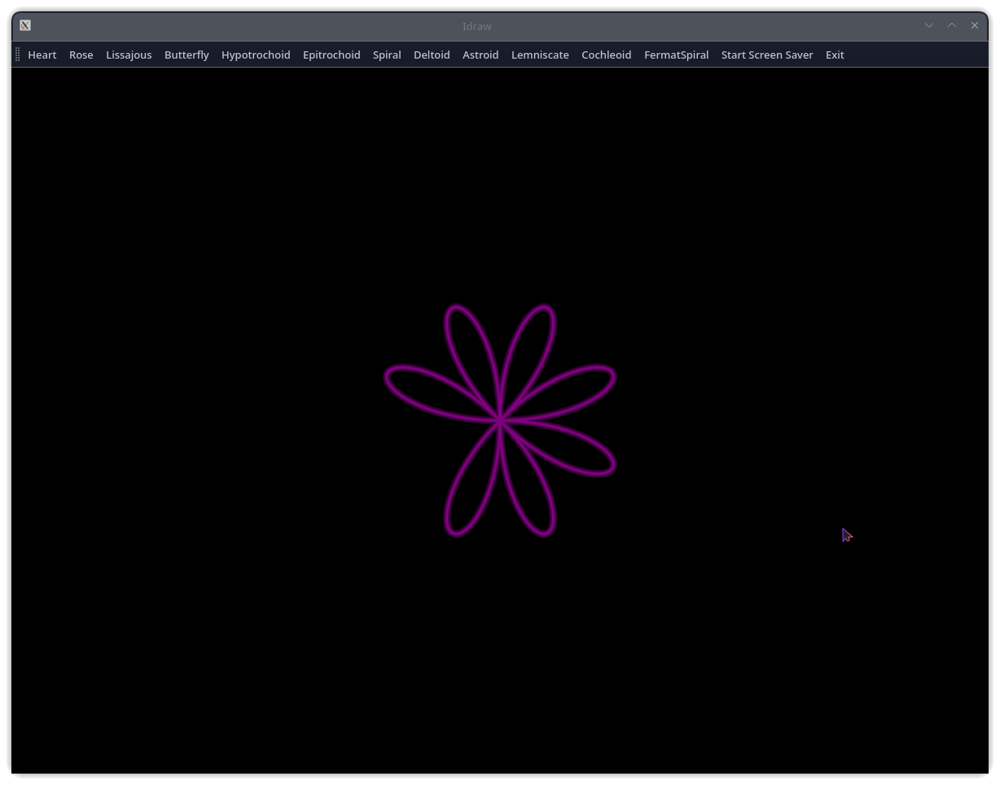

# 🎨 Idraw - The Ultimate Interactive Drawing & Screensaver App  

**Idraw** is a **visually stunning**, PyQt5-powered **drawing and screensaver application** that brings **mathematical beauty to life**.  
With **12 mesmerizing patterns**, **vivid colors**, and **smooth animations**, Idraw transforms your screen into a **digital artwork**.  

🔥 Perfect for **creatives, math lovers, and anyone who enjoys dynamic visuals!**  

---

## 🚀 Why You'll Love Idraw  

👑 **12 Unique Animated Shapes** – From mathematical wonders to artistic curves!  
💡 **Neon Glow Effects** – Breathtaking animations with smooth, modern visuals.  
🔗 **Interactive Screensaver** – Seamlessly runs across **multiple monitors**.  
🎨 **Customizable Colors & Speed** – Choose from **12 vibrant colors** and fine-tune the motion.  
🔄 **PyQt5-Powered GUI** – A sleek, **intuitive, and fast user interface**.  
🚀 **Optimized Performance** – Smooth animations without lag.  
🔧 **Versatile Usage** – Run in **normal mode** for interactive drawing or **full-screen mode** as a **screensaver**.  

📸 **Screenshot Preview:**  
  

---

## 💽 Installation  

### ✅ Prerequisites  
Ensure you have **Python 3.8+** installed on your system.

### 🔧 Install Dependencies  
Run the following command to install **PyQt5**:  
```bash
pip install PyQt5
```

---

## 📺 How to Use  

### 🔹 Launch the Application  
To start Idraw, run:  
```bash
python Idraw.py
```

### 🔹 Normal Drawing Mode  
- Select a **shape** from the toolbar.  
- Choose a **color** and **animation speed**.  
- Watch the **hypnotic movement** of your chosen shape inside the app window.  

### 🔹 Screensaver Mode  
- Click **"Start Screen Saver"** from the toolbar.  
- Pick a **shape, color, and speed**.  
- The screensaver **activates across all monitors**.  
- Press **"U"** to **exit screensaver mode**.  

---

## 🎨 Explore the Shapes  

| Shape          | Description |
|---------------|-------------|
| ❤️ Heart      | Classic mathematical heart curve |
| 🌹 Rose       | A hypnotic petal pattern |
| 🔄 Spiral    | Expanding Archimedean spiral |
| 🦋 Butterfly  | A mesmerizing butterfly curve |
| 🔠 Lissajous  | Elegant wave-based motion |
| 🔥 Hypotrochoid | Spirograph-style complex curves |
| 🌟 Epitrochoid | Stunning looping orbits |
| 🪴 Deltoid    | Smooth three-lobed symmetry |
| 🌀 Astroid    | A star-like mathematical curve |
| ∞ Lemniscate  | The infinity symbol pattern |
| ☯ Cochleoid  | A unique spiral evolution |
| 🌿 Fermat Spiral | Fibonacci-style spiral expansion |

---

## 🌈 Vibrant Color Choices  

💧 The application supports **12 stunning colors**:  
🔴 Red | 💚 Green | 💙 Blue | 💛 Yellow | 💊 Orange | 💜 Purple | 💗 Pink | ⚪ White | ⚫ Black | 🤔 Gray | 🦍 Cyan | 🌟 Magenta  

---

## 🛠 Customization  

Idraw is **fully modular**, and you can easily:  
- Add **new shapes** by extending the shape dictionary.  
- Modify **speed settings** to create custom animations.  
- Change **colors** or implement **gradient effects**.  

---

## 📝 License  

📚 This project is licensed under the **Apache License 2.0**.  
See [LICENSE](LICENSE) for details.  

---

## 💪 Developed by **Toxi360**  


